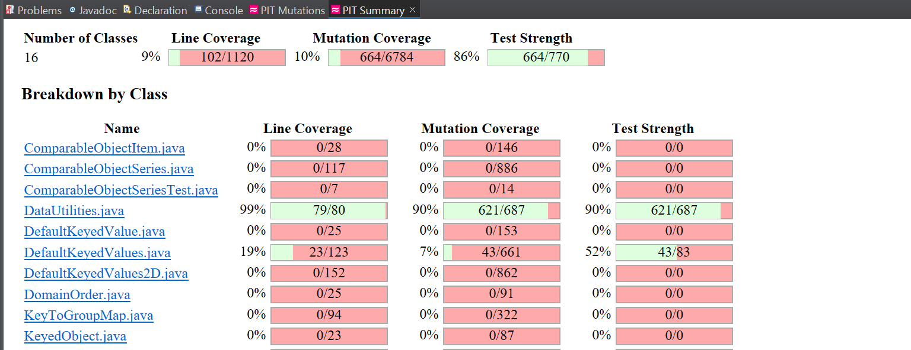
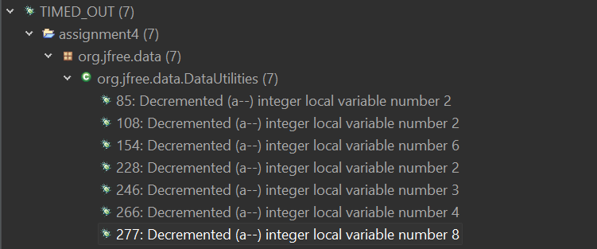

**SENG 637 - Dependability and Reliability of Software Systems**

**Lab. Report \#4 – Mutation Testing and Web app testing**

| Group: 10       | 
|-----------------|
| Amey Brahme     |   
| Tejpreet Bal    |   
| Dhananjay Roy   |   
| Harshil Patel   |   
| Munal Akhtar    |  

# Introduction
During this lab assignment, our primary focus centered around mutation testing and the utilization of the Selenium tool. These concepts were introduced in our lectures. Our group chose to employ the PIT testing tool for mutation testing, specifically to assess mutation coverage within Eclipse. In the latter part of the lab, we utilized the Selenium IDE extension on our individual browsers. The integration of mutation testing aimed to enhance error detection in the original source code. Our test cases were designed to identify vulnerabilities that might have been overlooked during initial testing. Additionally, the lab emphasized GUI testing, providing an introduction to automating test cases. We particularly focused on user interface interactions, allowing users to record and execute their scripts

# Analysis of 10 Mutants of the Range class 

1. Mutation 3, line #144 for contains(double value),
    Applied on the following line:
    ```
    return (value >= this.lower && value <= this.upper);
    ```
    **Mutation**: Changed conditional boundary\
**Result**: SURVIVED\
**Analysis**: This mutation was a boundary change mutation since it likely replaced the boundary conditions >= and <= with > and < respectively. This change affected the behavior of the contains(double value) method, causing it to exclude the lower and upper bounds of the range. However, the mutation survived because the test cases in the testContains() method did not check for values equal to the lower or upper bounds of the range. Therefore, the altered behavior of the contains(double value) method was not detected by the test cases, allowing the mutation to survive. To kill this mutation, additional test cases that check for values equal to the lower and upper bounds of the range should be added. For instance, the testContains() method could include test cases where it checks if the range contains its lower and upper bounds. As a result, when the mutation alters the boundary conditions, the calculated results would deviate from the expected results, leading to failed assertions in the test cases and consequently killing the mutation.

2.  Mutation 1, line #123 for getLength(),
    Applied on the following line:
    ```
    return this.upper - this.lower;
    ```

    **Mutation**: Replaced double subtraction with addition\
    **Result**: KILLED \
    **Analysis**: This mutation was an arithmetic operator replacement since it replaced the subtraction "-" with addition "+". This change affected the calculation of the range lengths, causing incorrect results. However, the mutation was successfully detected and killed by the test cases. For instance, the testLength() method included test cases where specific range objects were instantiated with defined lower and upper bounds. The test then compared the expected lengths of these ranges with the actual lengths. As a result, when the mutation altered the subtraction operation to addition, the calculated lengths became incorrect, leading to failed assertions in the test cases and consequently killing the mutation.

3. Mutation 6, line #193 for constrain(double value),
    Applied on the following line:
    ```
        else if (value < this.lower) 
    ```
     **Mutation**: Negated double field lower \
   **Result**: SURVIVED\
   **Analysis**: The test method testContrain() has a test with value equal to -2, and range of -1 to 1. In this case, where this.lower is -1, and is negated, the mutated condition becomes -2 < 1. Therefore, the result is set to this.lower, which is -1, and the method returns -1. This is the expected result for this test case, so the test case passes and the mutation survives. This is a good example of an equivalent mutant, where the mutation changes the code but does not change the observable behavior of the program    
 
 4. Mutation 3, line #123 for getLength(),
    Applied on the following line:
    ```
    return this.upper - this.lower;
    ```
     **Mutation**: Replaced return of double value with -(x + 1) \
   **Result**: KILLED\
   **Analysis**: This mutation replaced the return value with -(x + 1), introducing a negative increment in the calculation of range lengths. Despite this modification, the mutation was killed by the test cases. The test cases, such as those in the testLength() method, compared the expected lengths of ranges with the actual lengths using assertions. When the mutation altered the return value, the calculated lengths deviated from the expected values. Consequently, the test cases detected the inconsistency and resulted in failed assertions, effectively killing the mutation.

5. Mutation 2, line #123 for getLength(),
    Applied on the following line:

        ```
        return this.upper - this.lower;
        ```

     **Mutation**: Replaced double return with 0.0d\
   **Result**: KILLED\
   **Analysis**: This mutation replaced the return value with 0.0d, affecting the calculation of range lengths. Despite this alteration, the mutation was successfully killed by the test cases. For example, in the testLength() method, the test cases compared the expected lengths of ranges with the actual lengths using assertions. When the mutation replaced the return value with 0.0d, the calculated lengths became incorrect. Consequently, the test cases detected the discrepancy between the expected and actual lengths, leading to failed assertions and ultimately killing the mutation.

6. Mutation 5 on line #123 for getLength(),
    Applied on the following line:
    ```
    return this.upper - this.lower;
    ``` 
    **Mutation**: Negated double field lower\
   **Result**: KILLED\
   **Analysis**: This mutation negated the lower field value, impacting the code's behavior. However, the mutation was detected and killed by the test cases. Similar to the previous mutation, the testLength() method played a crucial role in detecting the mutation. By comparing the expected lengths of ranges with the actual lengths, the test cases identified discrepancies caused by the negation of the lower field value, resulting in failed assertions and ultimately killing the mutation.

7. Mutation 6 on line #123 for getLength(),
    Applied on the following line:
    ```
    return this.upper - this.lower;
    ```
    **Mutation**: Replaced double operation with first member\
   **Result**: KILLED\
   **Analysis**: This mutation replaced a double operation with the first member, which affected the code's behavior. However, the mutation was successfully detected and killed by the test cases. For example, in the testLength() method, specific range objects were created with defined upper and lower bounds, and their lengths were compared with expected values using assertions. When the mutation replaced the operation with the first member, it led to incorrect length calculations, causing the test cases to fail. Consequently, the mutation was effectively killed by the test cases.

8. Mutation 7 on line #123 for getLength(),
    Applied on the following line:
    ```
    return this.upper - this.lower;
    ``` 
    **Mutation**: Replaced double operation by second member\
   **Result**: KILLED\
   **Analysis**: This mutation replaced a double operation with the second member, impacting the code's behavior. However, the mutation was detected and killed by the test cases. Similar to the previous mutation, the testLength() method played a significant role in detecting the mutation. By comparing the expected lengths of ranges with the actual lengths, the test cases identified discrepancies caused by the replacement of the operation with the second member, resulting in failed assertions and ultimately killing the mutation.

9. Mutation 8 on line #123 for getLength(),
    Applied on the following line:
    ```
    return this.upper - this.lower;
    ```
    **Mutation**: Replaced double subtraction with addition\
   **Result**: KILLED\
   **Analysis**: This mutation was an arithmetic operator replacement, replacing subtraction "-" with addition "+". Despite this change affecting the code's behavior, the mutation was successfully killed by the test cases. For instance, in the testLength() method, specific range objects were instantiated with defined upper and lower bounds, and their lengths were compared with expected values using assertions. When the mutation replaced subtraction with addition, it led to incorrect length calculations, causing the test cases to fail. Consequently, the mutation was effectively killed by the test cases.

10. Mutation 10 on line #123 for getLength(),
    Applied on the following line:
    ```
    return this.upper - this.lower;
    ```
     **Mutation**: Replaced double subtraction with division\
    **Result**: KILLED\
    **Analysis**: This mutation replaced double subtraction with division, impacting the calculation of range lengths. However, the mutation was detected and killed by the test cases. Similar to previous mutations, the testLength() method played a crucial role in detecting the mutation. By comparing the expected lengths of ranges with the actual lengths, the test cases identified discrepancies caused by the replacement of subtraction with division, resulting in failed assertions and ultimately killing the mutation.

# Report all the statistics and the mutation score for each test class
## Initial Score and Statistics for Test classes
Range Class Initial Score

Range Class Initial Mutation Statistics

Data Utilities Class Initial Score

Data Utilities Class Initial Mutation Statistics


## Final Score and Statistics for Test classes
Range Class Final Score

Range Class Final Mutation Statistics

Data Utilities Class Final Score

Data Utilities Class Final Mutation Statistics


# Analysis drawn on the effectiveness of each of the test classes - Design Stratey
The mutation score of the test suite for the Range class was improved by adding additional tests to cover the mutations that were listed in the No_Coverage section of the PIT Mutations results. As seen in the screenshot below, there were 167 mutations that had no coverage for the Range class. We were able to raise the mutation coverage by over 10% just by targeting those mutations.

__No Coverage__


The mutation coverage was 90% initially, and there were no mutations in the NO_COVERAGE of the PIT test. To improve this, we targeted the survived mutations. While achieving a line coverage of 99% and 0 mutations in the NO_COVERAGE of the PIT test for DataUtilities is commendable, it's important to acknowledge that despite these achievements, the mutation coverage was only improved by 1%. This discrepancy could be attributed to several factors. Firstly, some mutations might have led to infinite loops, causing timeouts and consequently surviving the testing process. Additionally, certain mutations may have persisted because they resulted in changes that were not directly observable in the behavior of the method, especially under specific conditions. In such cases, these mutations may not significantly impact the overall functionality of the method. Furthermore, some surviving mutations might be equivalent mutations, meaning they produce equivalent results without affecting the observable behavior of the method. Considering these factors provides insight into why despite achieving high coverage rates, some mutations in DataUtilities may have survived, resulting in a mutation score of 91%.

__Time Out Infinite Loop__



# A discussion on the effect of equivalent mutants on mutation score accuracy
Mutation testing serves as a technique to evaluate the effectiveness of a test suite. In this process, the original program undergoes systematic modifications to create mutants, which are slightly altered versions of the code. A mutant is deemed “killed” when the test suite produces different outputs compared to the original program during execution. The more mutants that are successfully killed, the more effective the test suite is at uncovering faults.

However, a challenge arises due to the existence of equivalent mutants. These mutants exhibit the same behavior as the original program, making them indistinguishable from it. Consequently, the test suite fails to identify and eliminate these equivalent mutants. Although the test suite may effectively reveal other types of faults, the presence of equivalent mutants can distort the mutation score—the ratio of killed mutants to the total number of mutants. This discrepancy can lead to an inaccurate assessment of the test suite’s fault-revealing capability.

To mitigate this issue, researchers have developed techniques for identifying and removing equivalent mutants. These methods often involve program analysis and constraint solving. By enhancing the accuracy of mutation testing, developers gain deeper insights into their test suite’s strengths and weaknesses. This informed perspective enables them to make better decisions about improving the overall quality of their software.

# A discussion of what could have been done to improve the mutation score of the test suites

__Enhancing Mutation Testing Strategy for the Range Class:__

To improve our mutation testing strategy for the Range class, we could have adderessed the surviving mutations related to decremental or incremental scenarios. Developing targeted test cases that comprehensively cover these scenarios would have helped eliminate these mutations. Additionally, we could have focused on creating additional tests specifically designed to handle conditional operator mutations. By incorporating test cases that thoroughly utilize conditional logic, we can detect and eliminate mutations associated with these operators.

__Regarding the DataUtilities Test Class:__

Initially, mutation coverage was 90%, and there were no NO_COVERAGE mutations. Despite achieving high line coverage and addressing specific mutations, the overall improvement was minimal (1%). Factors like infinite loops, subtle changes, and equivalent mutations explain why some mutations persisted, resulting in a 91% mutation score for DataUtilities.

Although identifying and addressing specific mutations may be time-consuming, investing effort in refining our test class can provide valuable insights into potential bugs within our methods and thereby offer pathways to improvement in performance.

# Why do we need mutation testing? Advantages and disadvantages of mutation testing
Mutation testing serves as a valuable technique for evaluating the effectiveness of test suites. By systematically introducing mutants (slightly altered versions of the code) into the original program, we can assess whether the test suite can detect these changes. Here are the key points:

**Test Suite Quality Assessment:** Mutation testing provides a measure of test suite quality. It identifies areas where tests fail to detect modifications in the code. This highlights missing coverage in our test suite and helps improve overall coverage for our source code.  
**Enhancing Software Reliability:** By revealing weaknesses in test suites, mutation testing contributes to the overall quality and reliability of software systems. It ensures that our tests are robust and capable of catching potential faults.  

However, there are several challenges associated with mutation testing:

**Computational Cost:** Generating numerous mutants and executing the entire test suite against each one can be computationally expensive.  
**Complex Interpretation:** Interpreting mutation testing results can be intricate. Distinguishing false positives from false negatives may require manual effort.  
**Mutation Operator Selection:** The effectiveness of mutation testing heavily depends on the selection and implementation of mutation operators. Limited mutation operators may not adequately represent real-world faults, leading to incomplete testing.  

In summary, while mutation testing offers valuable insights into test suite quality, it also presents challenges such as computational costs and complexity.

# Explain your SELENUIM test case design process

The initial phase of our testing process involved adhering to the provided tutorials to gain a comprehensive understanding of Selenium's functionalities. Subsequently, we selected one website from the provided options for thorough examination.

Our testing commenced with fundamental assessments, such as scrutinizing the functionality of links within the navigation bar and evaluating the efficacy of the search feature. Following this, we delved into more intricate examinations, meticulously testing the responsiveness and accuracy of internal navigation links.

As our analysis progressed, we directed our attention towards scrutinizing the checkout process, assessing its robustness and efficiency. This step-by-step approach allowed us to methodically evaluate the website's performance and user experience, providing valuable insights into its functionality and potential areas for improvement.

Similar process was repeated for other two websites.

Some basic features used for all three websites were:  

  1. Get test data
  2. Simulate user action
  3. Check if the app functions as expected
  4. Output test results

Shop Smart Canada

| Test Number | Test Title | Test Description                                                                      | Test Results                                      | WebSite | 
|-------------|-------------------------------|---------------------------------------------------------------------------------------|---------------------------------------------------|----------|
| Test 1      | Search_Functionality_Check    | The search field was tested to see if correct results are shown for a search input.   | Behaves as expected                              | Shop Smart Canada Page |
| Test 2      | Navigation_Functionality_Check| The primary and secondary links on the navigation bar were checked to see their link is right. | Primary links on the navigation bar work fine. When a secondary link is clicked, it works on the website but fails while testing. | Shop Smart Canada Page |
| Test 3      | SignUp_Verification_Check    | Sign up using multiple personal details to verify the form works properly.| Accepts correct info but also accepts incorrect info. I was able to sign up using xyz@abc.com and 000-000-0000 phone number. It should send a verification link to the registered email to overcome this issue rather than just reply on RegEx. Verify that user successful registration message is displayed. It ran correctly the first time, now the says the user is already registered. Add assertion to make sure registration page is open, add verify to check if the sign up is successful or not. This test will show as failed only because the user profile has already been created and creating same profile is not allowed. So it does not go to the confirmation page at the end.| Shop Smart Canada Page |
| Test 4 | Shopping_Cart_Functionality_Check | Navigated from home page to baggage section and added a bag to cart. | No issues found | Shop Smart Canada Page |
| Test 5 | Change_MyStore_Location_Functinoality_Check | Search location closer to a actual store and expect a value and then check for a value where no Home Depot store exists and see if it shows 0 stores | No issues found | Home Depot Page |
| Test 6 | Cart_using_Popular_Categories_Functionality_Check | Using popular menu to check nagivation to a category and adding to cart | No issues found | Home Depot Page |
| Test 7 | HomePage_Navigation_Functinoality_Check | Go go services page and use the Home Depot logo to nagivate back to Home page. | No issues found | Home Depot Page |
| Test 8 | Order_Status_Funcationality_Check | We didn't have a order with Home Depot to check correct order number, but a check for incorrect order number being searched was made. Assertion for opening new window was used and verification of error message was used. | No issues found | Home Depot Page |
| Test 9 | Layout_Check | Check for images on key positions to ensure layout is as expected | No issues to report | Home Depot Page |
|Test 10 | Flyer_WishList_Functional_Check | Use the flyer to add items to wish list | No issues to report | Leon's Page |
|Test 11 | ContactUs_Form_Functional_Check |  Contact the help desk usng Contact us form | The contact us form uses catcha so testing might run into issues | Leon's Page |
|Test 12 | Search_CheckOut_Functional_Check | Using Search bar for adding items to checkout cart | No issues to report | Leon's Page |
|Test 13 | Flyer_Checkout_Functionality_Check | Use the flyer to add items to cehckout cart  | No issues to report | Leon's Page |


# Explain the use of assertions and checkpoints

In our quality assurance testing approach, we implement a systematic methodology centered around checkpoints to verify control data, validate content, and compare expected outputs within our system. We categorize these checkpoints into critical and standard classifications. Critical checkpoints, such as ensuring the accurate display of user information post-login, are rigorously validated using assertion statements. Conversely, standard checkpoints, including the validation of shopping cart contents, employ verification techniques to confirm expected outcomes. Test cases exemplify this approach: for instance, in Test 3, we assert the proper loading of the signup page before validating signup fields and verifying successful account creation. Similarly, Test 5 employs verification to confirm store changes and validate error handling for invalid inputs. Test 8 involves asserting the transition to the correct webpage post-"Check Status" button click, followed by verification of order number handling. Lastly, Test 9 utilizes image-based validation to ensure the consistency of the general layout. By delineating between assert and verify statements, we prioritize critical functionalities while conducting thorough checks across all system functionalities, thereby upholding software quality and reliability.

# how did you test each functionaity with different test data

In Test 1, we conducted tests on the search bar functionality, first using a category provided by ShopSmartCanada and then with a category not within their offerings. In Test 3, we deliberately entered both invalid and valid email addresses to pinpoint any bugs previously reported. Test 8 involved the input of invalid order numbers to scrutinize the order tracking page's handling of such instances. Additionally, in Test 5, we input a location proximate to a Home Depot to verify accurate retrieval of the nearest store and, conversely, a location devoid of Home Depot presence to confirm the absence of store listings for that search.

# How the team work/effort was divided and managed

One person each was assigned to figure out the setup and understand the procedure for both GUI testing and mutation testing. This was then discussed with all the team members. 2 mutations and 2 GUI tests were assigned to each of the 5 memebers to complete. The results were then compiled and each person wrote their part of the report. 

# Difficulties encountered, challenges overcome, and lessons learned

__Challenges Faced with PiTest and Selenium:__

During our lab, our team encountered significant challenges while working with PiTest. The absence of documentation in the lab materials made it challenging to effectively divide and execute tests for each class. Initially, we encountered several hurdles when running PiTest, prompting us to shift our focus to the Selenium section.

A key obstacle was our inability to run the test class if any individual tests failed. We needed to address these issues before proceeding with mutation coverage. Additionally, the varying run times of PiTest on different machines posed another challenge.

Furthermore, we faced difficulties with Selenium. Specifically, after recording and rerunning tests, we noticed that they did not function properly.

Overall, we experienced obstacles related to both PiTest and Selenium during the lab, valuable lessons were learnt while debugging/ configuring the software to work properly.

# Comments/feedback on the assignment itself

The lab assignment is designed to be engaging and insightful, with regards to topics of Mutation Testing and GUI testing. However, challenges in configuring the environment needlessly added to the amount of effort needed to set up the basis for performing the lab. Further clarity in the instructions for this assignment may prove helpful. 
